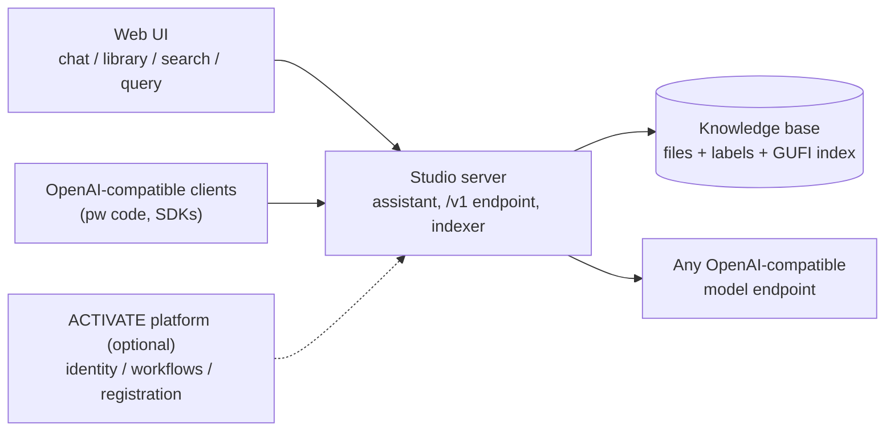

# ACTIVATE Studio

A standalone web workspace over a knowledge base directory: a chat assistant with tool calling grounded in the corpus, a library (file tree, viewer, upload and URL ingestion, original-file previews), hybrid search (full text plus semantic, including text inside office documents, PDFs, and images), and a structured query interface over the file index. It runs anywhere Node, Python, and GUFI run, against any OpenAI-compatible model endpoint.

It also integrates with the Parallel Works ACTIVATE platform when present: the platform's AI gateway works with zero configuration, the assistant gains workflow tools (catalog, DAG preview, dry-run validation, execution, run monitoring), and the app can be served as a platform session. None of that is required to use it.

The retrieval layer is built on GUFI, the Grand Unified File Index from LANL (per-directory SQLite index with fts5 and vec0 tables). How the whole system works, including incremental indexing and the need-to-know model, is documented in `docs/ARCHITECTURE.md`. Setup and branding for your own deployment: `docs/CUSTOMIZATION.md` and `.env.example`.

## Architecture



## Built on

- [GUFI](https://github.com/mar-file-system/GUFI) (Los Alamos National Laboratory): the metadata, full-text, and vector index.
- [sqlite-vec](https://github.com/asg017/sqlite-vec) and [sqlite-lembed](https://github.com/asg017/sqlite-lembed): embedding storage and on-index embedding with a local GGUF model.
- [@parallelworks/ai-chat](https://www.npmjs.com/package/@parallelworks/ai-chat): the chat interface components, driven by a custom adapter.
- [Streamdown](https://github.com/vercel/streamdown): streaming markdown rendering.
- [three.js](https://threejs.org/) and [occt-import-js](https://github.com/kovacsv/occt-import-js): the 3D model viewer and STEP conversion.
- [Tesseract](https://github.com/tesseract-ocr/tesseract): OCR for text inside images.
- [Fastify](https://fastify.dev/), [React](https://react.dev/), [Vite](https://vite.dev/): the server and the interface.

## Layout

- `server/` Fastify + TypeScript: KB API, hybrid search, chat tool loop against an OpenAI-compatible model endpoint, upload and URL ingestion, incremental indexing and background sweep, structured queries.
- `web/` Vite React SPA: Chat (full-canvas `@parallelworks/ai-chat`), Library, Search, Query, Help.
- `indexer/` GUFI toolchain build, full rebuild, enrichment (text extraction, OCR, vision captions), embeddings.
- `deploy/` optional ACTIVATE session serving.
- `docs/` architecture documentation and the in-app help content.

## Running standalone

```
pnpm install
pnpm build
indexer/setup_gufi.sh                          # one-time: GUFI toolchain + embedding model
KB_ROOT=/path/to/corpus indexer/reindex.sh     # first index build
KB_ROOT=/path/to/corpus node server/dist/main.js   # http://localhost:4080
```

Environment: `KB_ROOT` (corpus directory), `KB_LABEL`, `APP_NAME`, `APP_ICON` (path to a brand image), `HELP_FILE` (override `docs/HELP.md`), `SUGGESTED_PROMPTS` (JSON array), `APP_USER_ID`/`APP_USERNAME`/`APP_USER_NAME`, `SWEEP_INTERVAL_SEC` (default 300, 0 disables), `ADE_VISION_MODEL` (enables image captioning), `PORT`. A gitignored `.env` in the repo root is the place for deployment-specific values; `deploy/run_endpoint.sh` sources it.

## Running on macOS

The server and web app run from source on macOS the same way as the
standalone quick start above; the Linux-specific pieces are optional.
GUFI does not build on macOS, and the app runs without it: browsing,
grep search, chat, and viewers all work, while the indexed search and
query surfaces answer with empty results and a note until an index
exists. Document
extraction and previews use whatever tools are present: `brew install
--cask libreoffice` provides `soffice` for DOCX/PPTX previews, and
Word, PowerPoint and Excel files extract to Markdown through
`@giraffesyo/downmark`, bundled with the server, so they need nothing extra. The Apptainer container build below is
Linux-only.

## Container build

`deploy/app.def` packages the server, web build, GUFI, and the
extraction toolchain as a single Apptainer/Singularity image for
container-first sites (it is also what the compute-node workflow runs):

```
apptainer build studio.sif deploy/app.def
```

Run it with the knowledge base and index bound in:

```
apptainer run --bind /path/to/corpus:/kb --env KB_ROOT=/kb \
  --env INDEX_BASE=/kb-index --bind /path/to/index:/kb-index \
  --env PORT=4080 studio.sif
```

The build needs a Linux host (or VM) with Apptainer 1.2+; there is no
macOS container path. The deploy workflows pull a prebuilt image from a
bucket when one is configured, so most deployments never build locally.

## Models

The chat talks to any OpenAI-compatible backend.

- Standalone: set `OPENAI_BASE_URL` to the endpoint's `/v1` base and `OPENAI_API_KEY` to its key. OpenAI, vLLM, llama.cpp server, Ollama's OpenAI-compatible endpoint, and similar all work. The endpoint must serve `/models` and streaming `/chat/completions`; tool calling is required for the assistant's knowledge base and workflow tools.
- On ACTIVATE: with an authenticated pw CLI on the host, no configuration is needed at all; the server reads the CLI's credential for the platform gateway, and every model that account can reach appears in the chat's model selector automatically. Otherwise set `PW_API_KEY`. `PW_ALLOCATION` enables org-provider models.

## ACTIVATE integration (optional)

### Launch as an ACTIVATE workflow

`deploy/workflow.yaml` deploys Studio onto any connected resource from the ACTIVATE workflow form. Two source modes: GitHub (default; clones the repository and builds on the resource, fetching Node and the embedding model when absent) and bundle (a self-contained tarball built by `deploy/make_bundle.sh` for systems without outbound network, pulled from a bucket or pre-staged at `<workdir>/bundle-prestage.tar.gz`). Session methods follow the containerized-webapp-deployment pattern: `web` exposes the app through a forked `pw` endpoint that outlives the workflow, `e2e` launches, asserts `/healthz`, and tears down, `cleanup` stops everything a prior launch left behind. GUFI is built from source on the resource when cmake is available; without it the app still runs with filesystem browsing and grep search. `deploy/app.def` additionally packages everything as an Apptainer image for container-first sites. The workflow's scheduler placement runs the whole stack, model serve included, as one batch job on a compute node, in the resource's scheduler dialect (Slurm or PBS); it is documented in `deploy/COMPUTE.md`.

- The assistant's workflow tools (catalog with descriptions and tags, DAG preview, dry-run validation, execution on explicit request, run monitoring) come from the pw CLI and hide gracefully when it is absent. The knowledge base tools work everywhere.
- Serve as a platform session with `deploy/run_endpoint.sh`, which registers the app under the account's reserved subdomain.

## Ingestion

Files and URLs added through the Library's Add panel (or dragged onto the tree, folders included) land in a chosen corpus directory and are searchable in under a second via incremental subtree indexing. Files that arrive outside the UI (scp, generators, git) are picked up by the background sweep within one interval, or immediately via the sync now button.
